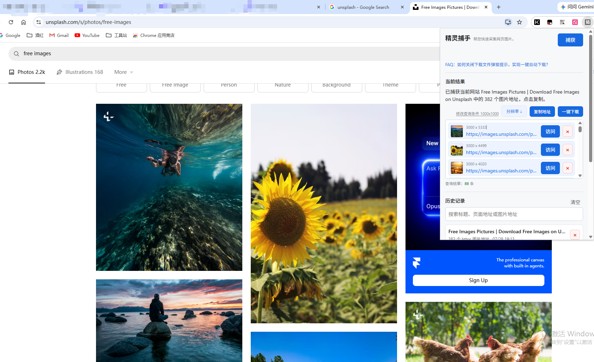

# 精灵捕手

精灵捕手是一个 Chrome 浏览器扩展，用于一键捕获当前网页中的图片地址，并支持在插件面板中查看、筛选、复制、排序、下载和管理历史记录。



## 功能特点

- 一键捕获当前标签页中的图片地址
- 自动识别 `img`、`source srcset`、图片链接和 CSS 背景图
- 仅保留可下载的 `https://` 图片地址，并排除 SVG
- 展示图片缩略图、地址和分辨率
- 支持按分辨率升序或降序排序
- 支持按最小宽度、最小高度筛选结果
- 支持复制当前查询结果中的图片地址
- 支持一键批量下载图片
- 自动保存捕获历史，支持搜索、分页、删除和清空

## 安装方式

1. 打开 Chrome 浏览器，进入 `chrome://extensions/`。
2. 打开右上角的“开发者模式”。
3. 点击“加载已解压的扩展程序”。
4. 选择本项目目录。
5. 在浏览器工具栏中固定“精灵捕手”扩展，方便后续使用。

## 使用说明

1. 打开需要采集图片的网页。
2. 点击浏览器工具栏中的“精灵捕手”图标。
3. 点击“捕获”按钮，插件会读取当前页面中的图片地址。
4. 根据需要使用“修改查询条件”筛选指定分辨率以上的图片。
5. 使用“分辨率”按钮调整排序。
6. 点击单条图片地址可复制该地址，点击“复制地址”可复制当前查询结果中的全部地址。
7. 点击“一键下载”可批量下载当前查询结果中的图片。

## 下载提示

如果希望下载时不再弹出保存位置选择窗口，可以在 Chrome 设置中搜索“下载前询问每个文件的保存位置”，并关闭该选项。

## 权限说明

本扩展会使用以下浏览器权限：

- `activeTab`：读取当前活动标签页。
- `scripting`：在当前页面中注入图片采集脚本。
- `storage`：保存捕获历史和查询条件。
- `downloads`：创建图片下载任务。
- `tabs`：打开图片地址或读取当前标签页信息。
- `<all_urls>`：允许在不同网站页面中采集图片地址。

## 项目结构

```text
.
├── background.js      # 后台逻辑，负责捕获、历史记录和下载
├── content.js         # 页面脚本，负责从 DOM 中采集图片地址
├── manifest.json      # Chrome 扩展配置
├── popup.css          # 插件弹窗样式
├── popup.html         # 插件弹窗页面
├── popup.js           # 插件弹窗交互逻辑
└── img/
    └── unsplash_capture.png
```
